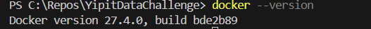
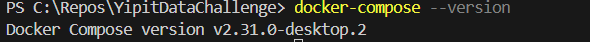

# YipitData Oscar Movie Scraper - Airflow Assignment

This project implements an Apache Airflow pipeline to scrape Oscar-nominated movie data from the YipitData API ('http://oscars.yipitdata.com/'), enrich it with details (including budget), transform the data (cleaning Year and Budget), and export the results to a CSV file. The entire Airflow instance runs within Docker containers.

## Requirements

*   Docker (version 27.+)

    
*   Docker Compose (version v2.+)

    

## Setup and Running

1.  **Clone/Download:** Get the project files onto your local machine.
2.  **Environment File:** In the '.env' file I did not add 'AIRFLOW_UID' and 'AIRFLOW_GID', becuase I am using windows system, but if you are using other o.s, please  in '.env' uncommented those values. To know the values, please Run 'id -u' and 'id -g' in your terminal to find these values.
3.  **Build the Custom Airflow Image:**
    Run the instruction: forcing a clean building
    docker-compose build --no-cache
4.  **Initialize Airflow Database & User:** 
    Run the instruction: (Only needs to be run once)
    docker-compose run --rm airflow-webserver airflow db init
    **NOTE:** 
    *(The provided 'docker-compose.yml' includes an 'airflow-init' service that handles 'db init' and user creation automatically when starting up for the first time.)*

5.  **Start Airflow Services:**
    Run the instructions: 
    docker-compose up -d

    This command starts the Airflow webserver, scheduler, postgres database (and Redis/worker if configured) in detached mode.

6.  **Access Airflow UI:** Open your web browser and navigate to http://localhost:8080
    *   Login with the default credentials (unless changed in 'airflow-init' command or manually):
        *   Username: 'admin'
        *   Password: 'admin'

## Running the DAG

1.  **Find the DAG:** In the Airflow UI, locate the DAG named 'yipitdata_oscar_pipeline'.
2.  **Enable the DAG:** If it's paused (toggle switch on the left), click the switch to enable it.
3.  **Trigger the DAG:** Click the "Play" button (▶️) under the "Actions" column for the DAG. Choose "Trigger DAG".
4.  **Monitor Execution:** You can monitor the DAG run's progress in the "Grid" or "Graph" view. Click on individual task instances to view their logs.
5.  **Output:** Upon successful completion of the 'export_to_csv' task, the transformed data will be saved as 'oscar_movies_transformed.csv' inside the 'output/' directory in your project's root folder on your host machine (this directory is mounted into the container).

## Assumptions and Design Choices

*   **API Structure:**
    *   Assumes the base URL 'http://oscars.yipitdata.com/' redirects or directly serves paginated JSON data under the 'results' key, with a 'next' key containing the URL for the next page.
    *   Assumes each movie object in the initial list contains a 'Detail URL' key pointing to a page (or endpoint) with more details.
    *   Assumes the 'Detail URL' page might return JSON *or* HTML. The current implementation prioritizes JSON but includes logging/warnings for HTML and a placeholder for potential future HTML parsing (e.g., using BeautifulSoup4). It attempts a very basic regex for budget from HTML as a fallback, but this is fragile.
    *   Assumes the key names in the JSON responses are as inferred (e.g., 'Film', 'Year', 'Oscar Winner', 'Detail URL', 'Budget' from detail page). Renaming is handled in the 'transform_data' task.
*   **Budget Cleaning ('clean_budget' function):**
    *   **NaN/Missing:** To Convert null, NaN, empty strings, or "N/A" to '0'.
    *   **Ranges:** Detects ranges (e.g., "$10M - $20M", "£5-7 million") and uses the *lowest* value found.
    *   **Currency Conversion:** Detects common currency symbols/codes (£, $, €, EUR, GBP, CAD, etc.) at the start or end of the budget string. If a known non-USD currency is found, it converts the value to USD using *fixed placeholder exchange rates* defined in 'dags/utils/cleaning.py'. **This is a major simplification.** A production system would need historical exchange rates or an API. If no currency symbol/code is detected, **USD is assumed**.
    *   **Multipliers:** Handles 'M'/'million' (1,000,000) and 'K'/'thousand' (1,000).
    *   **Output:** Returns the final budget as an integer.
*   **Year Cleaning ('get_decade' function):**
    *   Extracts the first valid 4-digit year found in the input string/number.
    *   Calculates the start of the decade (e.g., 1997 -> 1990).
    *   Returns 'None' if a year cannot be parsed.
*   **Error Handling:**
    *   API request errors (network, HTTP status codes) will typically fail the 'extract' or 'enrich' task.
    *   Errors fetching *individual* movie details in the 'enrich' task are logged, and the original movie data (without enrichment) is carried forward to allow the DAG to process other movies.
    *   Parsing errors during transformation (e.g., unexpected budget format) are logged, and default values (like 0 for budget, None for decade) are often used to prevent task failure, though this depends on the specific cleaning logic.
*   **Dependencies:** Requires 'requests' for API calls and 'pandas' for data transformation and CSV export. These are installed via 'requirements.txt'.
*   **Output Schema:** The final CSV adheres to the specified schema: 'film', 'year', 'decade', 'wikipedia_url', 'is_oscar_winner' (boolean), 'original_budget' (raw string), 'budget_usd' (integer).

## Bonus Features Implemented

*   **Budget Cleaning:** The 'clean_budget' function addresses the requirements for handling NaNs, ranges, and currency conversion (using placeholder rates).
*   **Unit Tests:** Basic unit tests for 'get_decade' and 'clean_budget' helper functions are provided in 'tests/test_cleaning.py'. These can be run locally using 'pytest' (install 'pytest' via pip if not already installed). Navigate to the project root and run 'pytest'.

